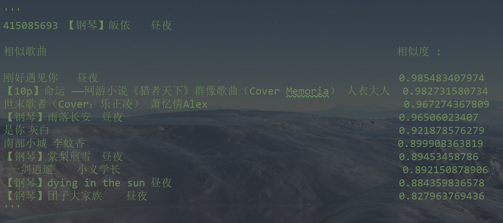

## 1.Music Recommendation System (大型音乐推荐系统实现)

### 项目背景
>  该项目出发点在于基于已有大型网易云音乐中，歌单的爬虫数据，实现一个从数据预处理，到模型搭建，再到相应细节的参数对齐……较为完整的音乐推荐系统。由于主要是流程算法项目，该项目主要实现的推荐效果在代码的输出中有显示。 基于协同滤波的推荐算法底层原理很简单，但是应用于大数据背景时，如何筛选有效数据特征以及如何合适将数据嵌套在该算法下，是非常有细节考究的。协同滤波算法分为基于user和基于item两种，本项目两种方式都有实现。 基于Song2Vec的推荐算法类似于词嵌入原理，根本目的是想在一个指定的向量空间映射每个数据的特征，再依据近邻的相似度计算出在映射空间中，相似的数据。从而得到不同数据间相似度的一个统计，进而实现推荐系统输出‘猜你喜欢’的推荐效果。 ps.由于本项目基于的数据是现成的网易云音乐中歌单的数据，歌单相当于一个user，歌单中歌曲相当于item。但是由于数据量巨大（约20G）无法上传，如有需要可以私信我。
  
### 代码流程
|名称|作用|
|:-------------:|:-------------:|
|1.Data Transfer and Preprocess|数据格式转换和预处理|
|2.Model Building and Training (Estimate)|基于协同滤波推荐系统模型搭建和性能评估|
|3.Sequence Model (Song2Vec)|基于Song2Vec滑窗嵌入模型实现推荐系统|
|4.TensorFlow Realization|基于TensorFlow实现音乐推荐系统|
|5.Spark Model (user-based CF)|使用Spark分布式组件基于user实现推荐系统|
|6.Spark Model (item-based CF)|使用Spark分布式组件基于item实现推荐系统|
|7.Spark Recommendation Package|Spark组件包整理|
|Data Form|数据格式说明|

### 效果图
#### ·一部分简单的推荐效果算法输出结果

