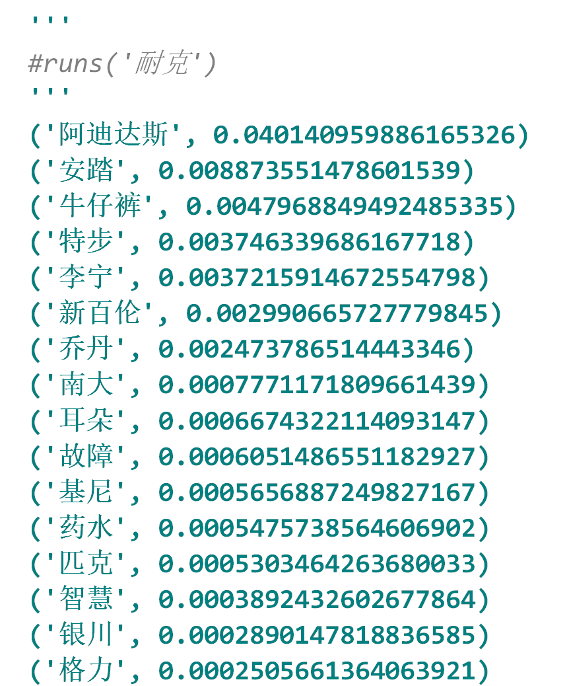
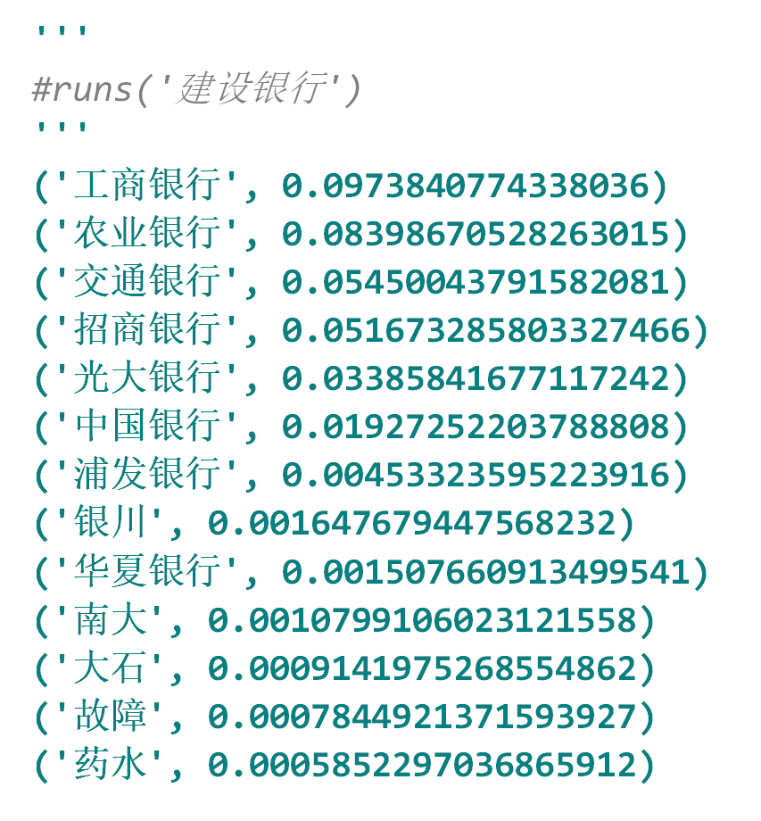
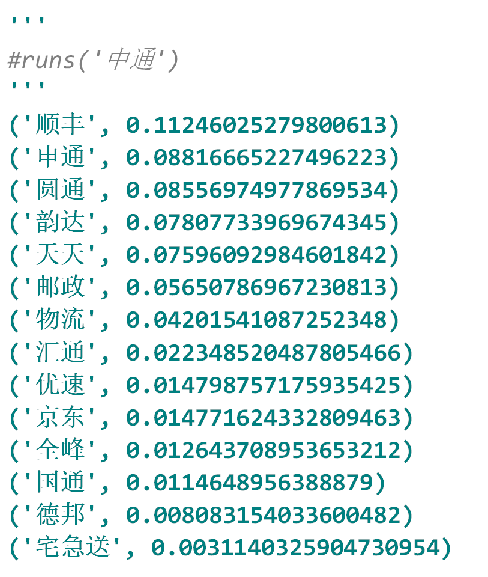
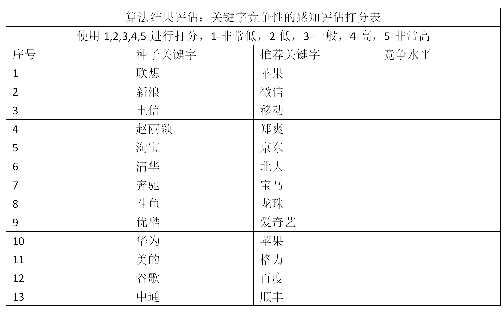
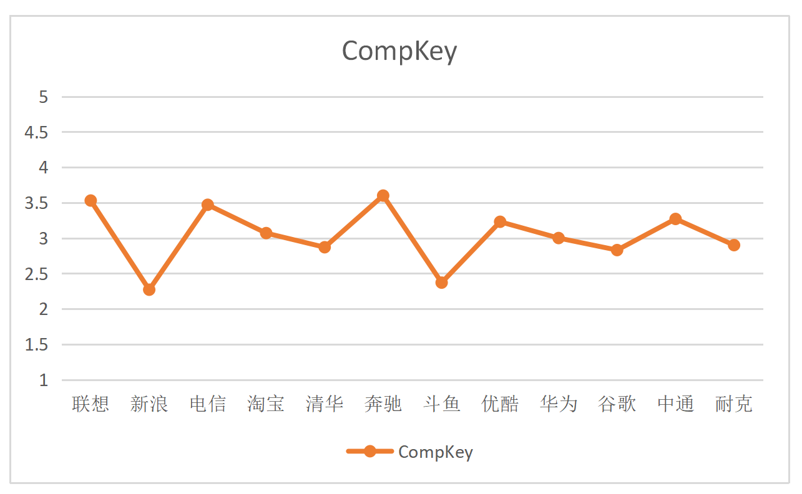

## Competitive Key Word Recommendation Algorithm 
## (竞争性关键词推荐的数据挖掘)

### 项目背景
>  关键字推荐方法：CompKey算法主要是选取种子词s,关键词k,以及中介词a，a是既能够同时与s出现在同一查询词集合中，也能同时与k出现在同一查询词集合中，但是k,s不频繁出现在同一查询中，a越多证明s,k这两个词的竞争性也越强，也就是说，通过查找两个关键词分别和多个相同的中介关键词同时出现在统一查询中的次数越多，竞争性越高，我们就需要根据s,a来得出相应竞争度最高的k来进行广告竞争，让广告品牌了解用户搜索意图，进行相应的竞争情报分析和提出营销策略。本项目基于搜狗开源脱敏搜索数据集，在10万条搜索数据中，实现竞争性关键词的统计和提取。由于数据集过大无法上传，如有需要，私聊联系我。

### 算法流程
所有关键词全集：K 
广告主的种子关键词：s （s ∈ K ） 
推荐高相关性的关键词：KM （ KM ∈ K ） 
（1）相关分析法：计算词与词之间的相关程度。 
关联相关性、同义词相关性、竞争相关性等 
分两类：互补性和竞争性 
例如：宝马—4S店/宝马—奔驰 
（2）方法：基于用户反馈方法、基于文本分析法、基于语义知识库等 
（3）目的：通过了解用户搜索意图来获得KM  

### 伪代码
Step1: 通过对查询日志的搜索，提取出所有与种子关键字s同时出现的中介关键字a。 
Step2: 计算出所有包含s与sa的查询搜索量。 
Step3: 计算所有中介关键字权重。 
Step4: 对查询日志进行搜索以确定不同时与s出现，但与某一个中间关键字同时出现的竞争性关键字集合，然后计算每个竞争关键字的竞争度

  
### 代码流程
|名称|作用|
|:-------------|:-------------:|
|1.TrainData_Query_14W|全部1400W条搜狗搜索记录数据缩水1/100得到14W条搜索记录|
|2.TrainData_Word_7W|整理出14W条搜索数据中的所有不重复词组全部7W个|
|3.TrainData_NounWord_5W|整理出7W条词组中所有名词全部5W个|
|4.TrainData_NounWord_1000|每隔50个名词放进集合得到1000个实验名词|
|funcs|底层实现各个功能函数包|
|main|算法最终实现效果结果输出|

### 效果图
#### ·输出示例结果（1）

#### ·输出示例结果（2）

#### ·输出示例结果（3）

#### ·输出结果竞争性直观问卷调查

#### ·竞争性波动统计图

