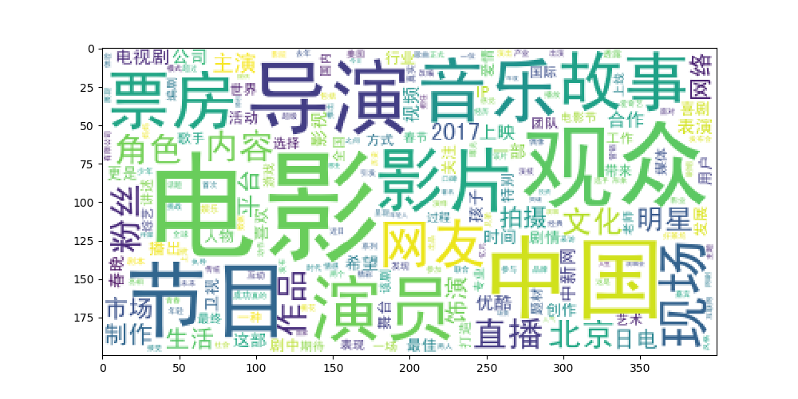
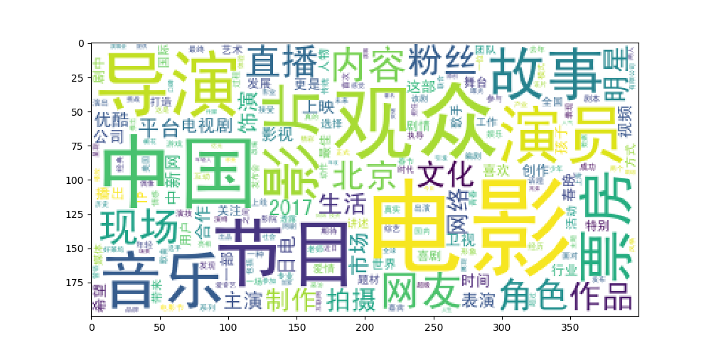
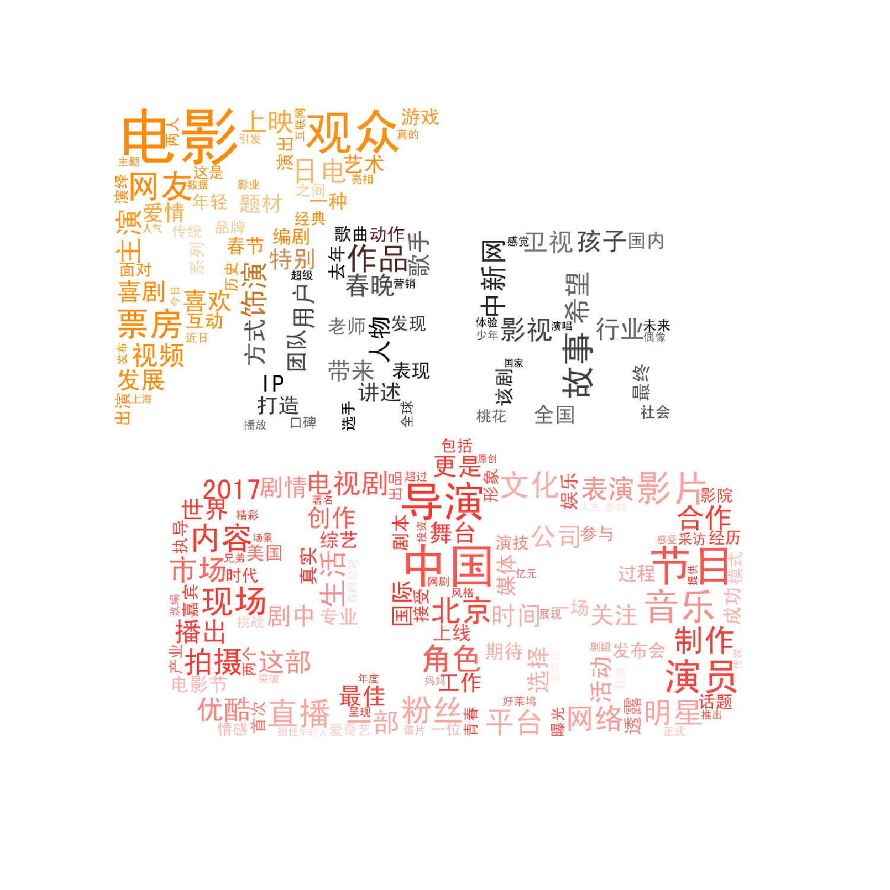
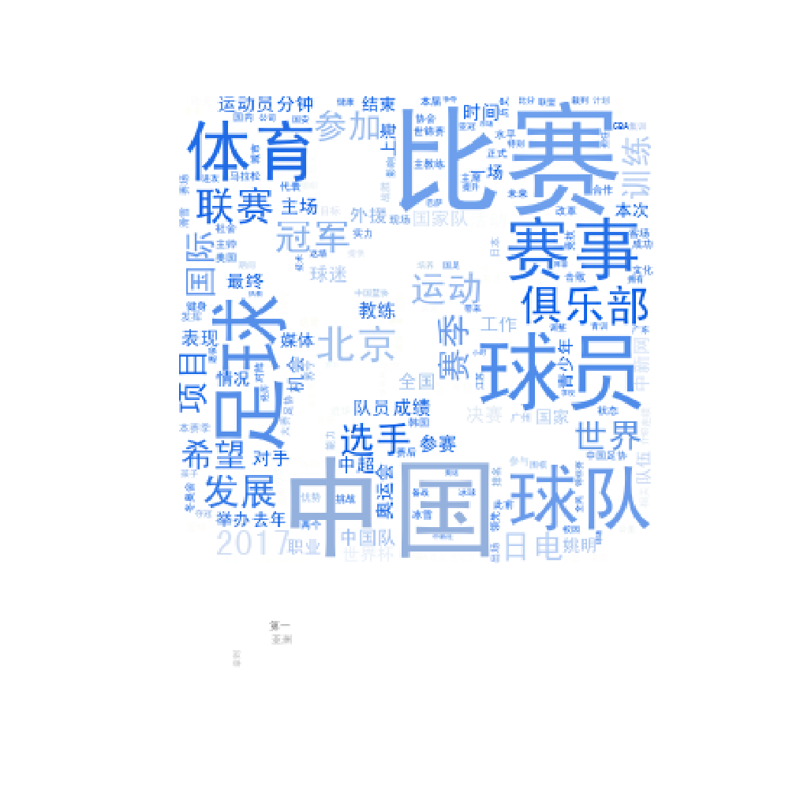

## Document Topic Model and Classification
## (文本主题模型及分类器)

### 项目背景
>  文本主题模型是深度学习的另外一个重要内容，用来发现大量文档集合的主题的算法。借助这些算法我们可以对文档集合进行归类。适用于大规模数据场景。目前甚至可以做到分析流数据。需要指出的是，话题模型不仅仅限于对文档的应用，可以应用在其他的应用场景中，例如图像处理和社交网络。这是一种新的帮助人类组织、检索和理解信息的计算工具。

> 通过这类算法获得的那些主题都可以比喻成望远镜不同的放大倍数。我们可以根据特定的情形设置可以看到的关注对象的精度；并且可以研究主题随着时间变化产生的相关变化。这样的思考方式对于很多场景都是有效的，例如在搜索时，我们可以把单纯使用关键词的相关性推进到结合主题的结果整合从而给用户更好的使用体验。
  
### 代码流程
|名称|作用|
|:-------------|:-------------:|
|1.chinese_text_word_cloud|中文词云生成实践|
|2.chinese_text_analysis|基于TF-IDF中文文本分析|
|3.chinese_text_classifier|基于贝叶斯中文文本分类器|
|4.facebook_fasttext|FastText模型有监督学习和无监督学习|
|5.CNN_text_classification|使用CNN滑窗实现文本分类|
|6.BOW_text_classification|词袋模型实现文本分类|
|7.GRU_text_classification|GRU文本分类器实践|

### 效果图
#### ·中文词云生成图像

#### ·中文词云生成图像

#### ·目标词云生成背景主题

#### ·基于目标背景中文词云生成图像

#### ·目标词云生成背景主题

#### ·基于目标背景中文词云生成图像

