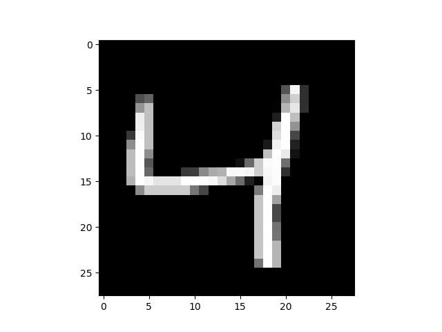
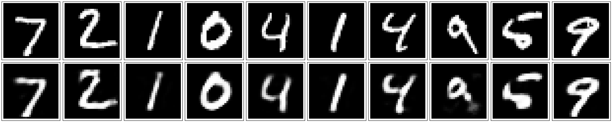
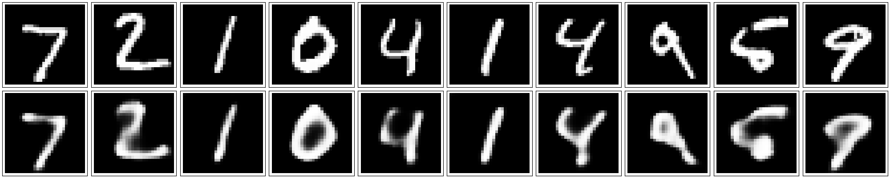
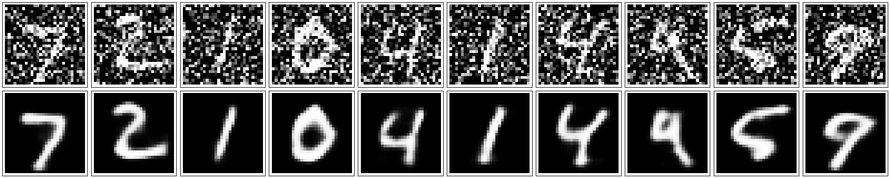

## AutoEncoder
## (自编码机)

### 项目背景
>  AutoEncoder是深度学习的另外一个重要内容，并且非常有意思，神经网络通过大量数据集，进行end-to-end的训练，不断提高其准确率，而AutoEncoder通过设计encode和decode过程使输入和输出越来越接近，是一种无监督学习过程。有趣的是，我们控制encode的输出维数，就相当于强迫encode过程以低维参数学习高维特征，这导致的结果和PCA类似。AutoEncoder的目的是使输入x和输出y越相似越好，这就需要在每次输出之后，进行误差反向传播，不断优化。本项目分别实现了简易自编码机，卷积自编码机，和深层降噪自编码机。
  
### 代码流程
|名称|作用|
|:-------------:|:-------------:|
|simple_autoencoder|一个最基本的自编码机实现|
|convolution_autoencoder|卷积自编码机实现|
|denoise|深度自编码机实现降噪|

### 效果图
#### ·显示MNIST数据集一个图像

#### ·简易自编码机实现效果

#### ·卷积自编码机实现效果

#### ·深度降噪自编码机实现效果

